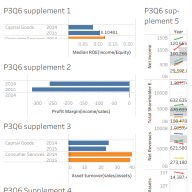
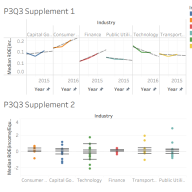
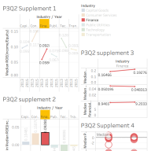

# Tableau Financial Statement Analysis

## Project Overview

This Tableau project analyzes company financial statement data across multiple industries. The workbook uses balance-sheet and income-statement information to answer business questions, compare companies and industries, and evaluate profitability and operating efficiency through financial ratios.

The analysis includes **Return on Equity (ROE), Profit Margin, Asset Turnover, and Financial Leverage**, along with company- and industry-level comparisons. The workbook also contains summary dashboards for selected analysis questions.

## Project Files

```text
Tableau_Financial_Statement_Analysis.twbx   # Packaged Tableau workbook (recommended file to open)
workbook/
  Tableau_Financial_Statement_Analysis.twb  # Tableau workbook definition / source

data/
  financial_statements.hyper                # Embedded Tableau data extract
  README.md                                  # Notes about the dataset

docs/
  data_dictionary.md                        # Dataset fields and calculated measures
  project_questions.md                      # Main analysis questions found in the workbook

screenshots/
  README.md                                  # Add dashboard images here for GitHub preview
```

## Main Analysis

The workbook explores questions such as:

- Total assets across companies and years.
- Number of companies represented in the dataset and by industry.
- Industry sales comparisons.
- Companies with the highest sales over the analysis period.
- Industry-level financial performance using median values.
- Company ROE comparisons within each industry.
- Identification of companies with negative profit margins and high asset turnover.
- Changes in company ratios from 2014 to 2015 compared with changes in the company's industry.

## Financial Ratios Used

| Ratio | Formula | Purpose |
|---|---|---|
| Return on Equity (ROE) | Net Income / Total Shareholder Equity | Measures profit generated relative to shareholder equity. |
| Profit Margin | Net Income / Net Revenues | Measures how much profit a company earns from its sales. |
| Asset Turnover | Net Revenues / Total Assets | Measures how efficiently assets are used to generate sales. |
| Financial Leverage | Total Assets / Total Shareholder Equity | Measures the extent to which assets are financed relative to equity. |

The workbook also calculates industry-level median versions of these metrics using Tableau FIXED level-of-detail calculations.

## Tools and Skills Demonstrated

- Tableau Desktop
- Data visualization and dashboard design
- Financial statement analysis
- Financial ratio analysis
- Calculated fields
- Level-of-detail (LOD) expressions
- Industry benchmarking
- Data filtering, sorting, and comparison

## Data

The original workbook was created from an Excel financial-statement dataset with separate **Balance Sheet Data** and **Income Statement Data** sheets. The original `.xls` file is not included in the packaged workbook, but Tableau stored the data in the embedded `financial_statements.hyper` extract included in this repository.

Because the `.twbx` file already contains this extract, the project can be opened and reviewed without the original Excel source file.

See [`docs/data_dictionary.md`](docs/data_dictionary.md) for the available fields.

## How to Open the Project

1. Install **Tableau Desktop** or **Tableau Public**.
2. Download `Tableau_Financial_Statement_Analysis.twbx` from this repository.
3. Open the `.twbx` file in Tableau.
4. Explore the worksheets and dashboards.

> The `.twbx` file is the easiest file to use because it packages the workbook and its Tableau data extract together.

## Suggested GitHub Preview

For the best portfolio presentation, export two or three of your strongest Tableau dashboards as PNG images and place them in the `screenshots` folder. Then add those images near the top of this README.

Example Markdown after you add an image:

### Financial Ratio Dashboard


### ROE Analysis


### Industry Comparison

## Portfolio Description

**Tableau Financial Statement Analysis** — Built an interactive Tableau workbook using company balance-sheet and income-statement data to analyze sales, assets, profitability, efficiency, and leverage across industries. Created financial-ratio calculations, industry benchmarks using LOD expressions, sorted company comparisons, and summary dashboards to identify financial performance trends.
